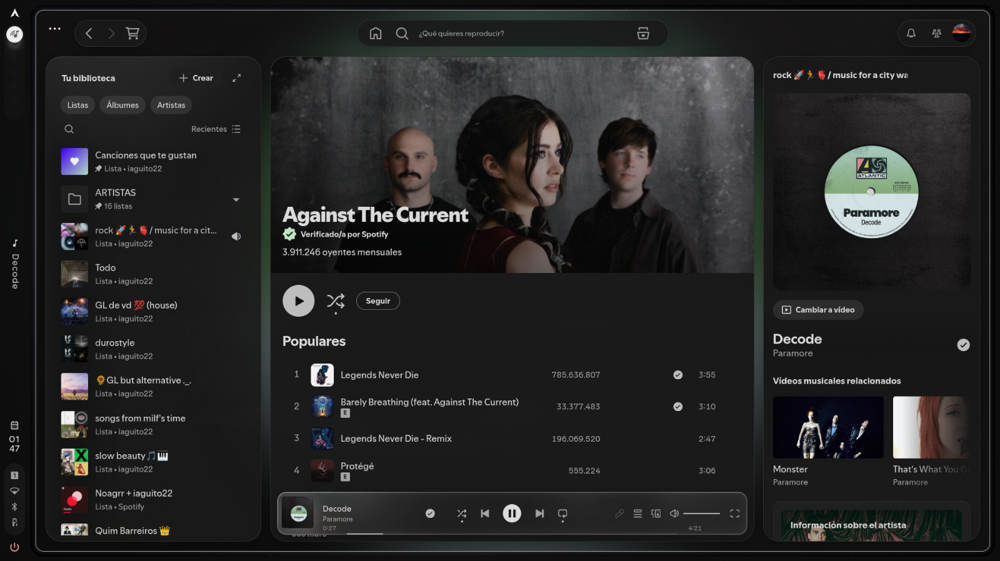
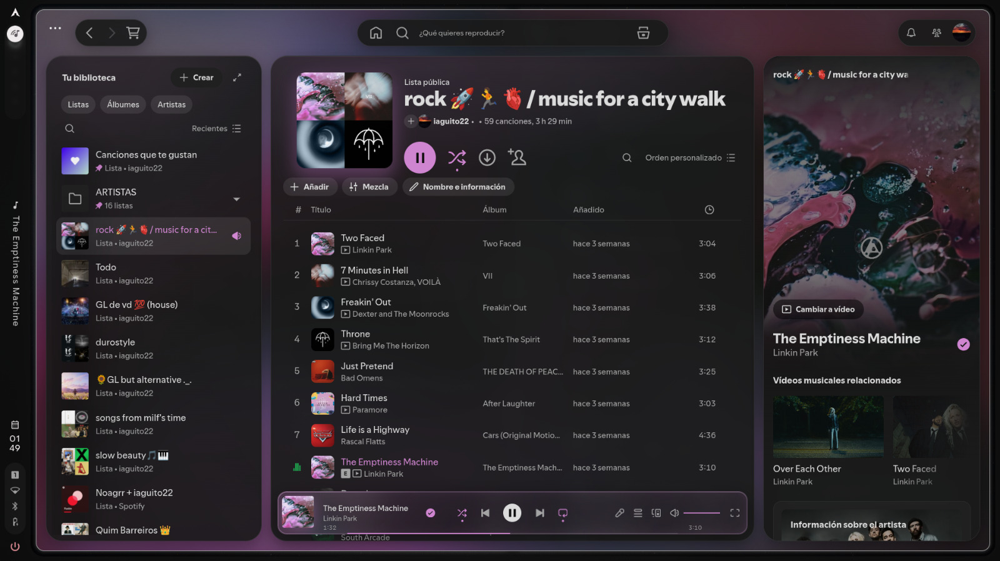
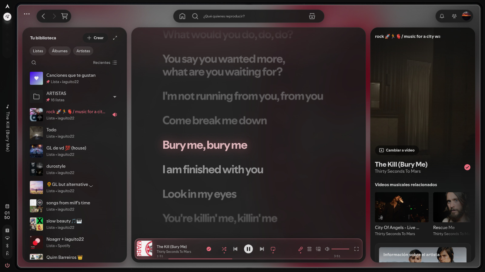

# Caelestia for Spicetify

Floating "island" panels, an ambient background and accent color taken from the current cover, and a liquid-glass player dock. Dark and light.





## What it does

- **Islands:** library, main view and right sidebar float as rounded panels with concentric corners (28 → 16 → 8 px). Three floating pills on top: navigation, search, profile.
- **Ambient background:** the cover of the current song, blurred, crossfades behind everything.
- **Dynamic accent:** the accent color (play button, progress, highlights, glass tint) is picked from the cover and eases between songs.
- **Player dock:** a floating liquid-glass bar. The progress bar is the bottom edge of the dock and grows on hover.
- **Playlist header:** cover, title and controls integrated in one header; column header turns into glass only when it sticks.
- **Lyrics:** big type, active line in the accent color, lines blur by distance, edge fade.
- **No scrollbars.** Dark and light follow the color scheme.

## Install

Requires [Spicetify](https://spicetify.app) already installed and applied to Spotify.

**Linux / macOS**
```bash
git clone https://github.com/iaguito22/spicetify-caelestia
cd spicetify-caelestia
./install.sh          # or ./install.sh light
```

**Windows (PowerShell)**
```powershell
git clone https://github.com/iaguito22/spicetify-caelestia
cd spicetify-caelestia
.\install.ps1         # or .\install.ps1 light
```

Manual: copy `caelestia/` to `<spicetify config dir>/Themes/caelestia/` (`spicetify -c` prints the config path), then

```
spicetify config current_theme caelestia color_scheme dark inject_theme_js 1 inject_css 1 replace_colors 1
spicetify apply
```

Switch mode any time: `spicetify config color_scheme light` (or `dark`), then `spicetify apply`.

## Caelestia shell users

If you use the [Caelestia](https://github.com/caelestia-dots/shell) shell, its scheme generator overwrites `color.ini` (scheme name `caelestia`) whenever you change scheme, and the theme follows it, light/dark included. Set `color_scheme = caelestia`.

## Status and limits

- Built and tested on **Linux (Arch, Hyprland) with Spotify 1.2.96**. Spotify's class names change between versions; lyrics and the right sidebar break first.
- **Windows and macOS are untested.** The theme reserves room for the native window controls (top-right on Windows, top-left on macOS), but the sizes are a guess. Please open an issue with a screenshot if something overlaps.
- On Linux the native "···" window menu at the top-left can't be removed from CSS; the navigation pill leaves room for it.
- Light mode: tested on playlist, artist, search, home and lyrics. Context menus and albums weren't checked.

## License

MIT

---

## En español

Tema de Spicetify con paneles flotantes, fondo ambiental y acento sacados de la portada, y un reproductor flotante de cristal líquido. Claro y oscuro.

Instalación: con Spicetify instalado, `./install.sh` (Linux/macOS) o `.\install.ps1` (Windows). Para cambiar de modo: `spicetify config color_scheme light` (o `dark`) y `spicetify apply`.

Probado en Linux con Spotify 1.2.96. **Windows y macOS no están probados**; si algo se solapa con los controles de la ventana, abre un issue con una captura.
