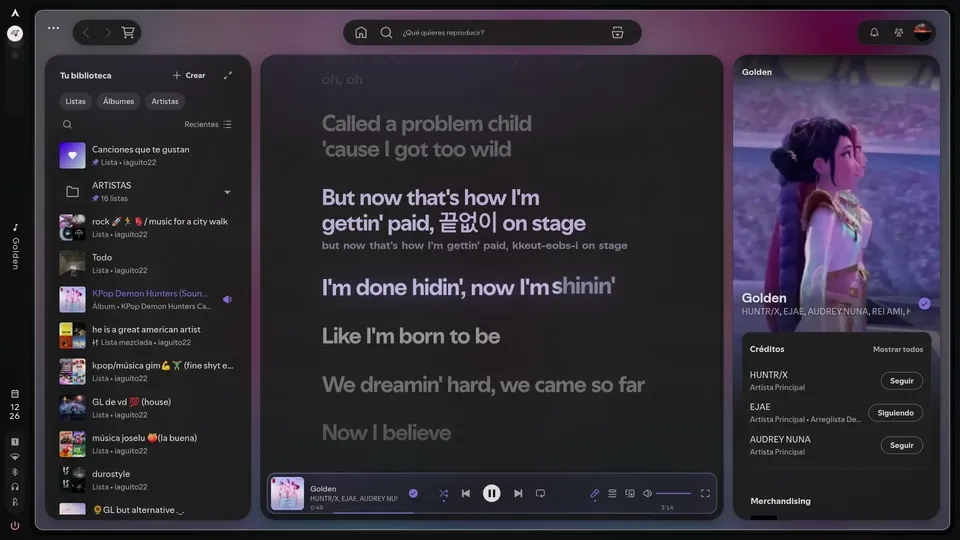
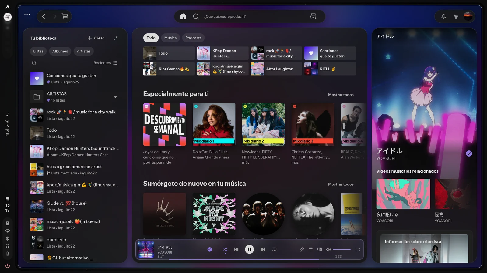
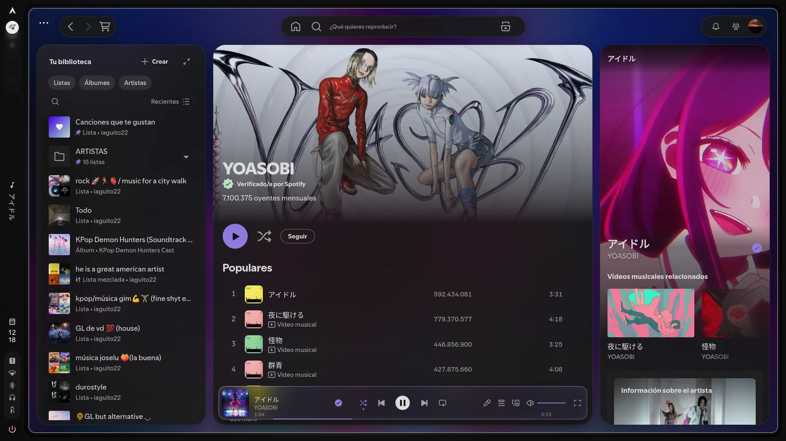
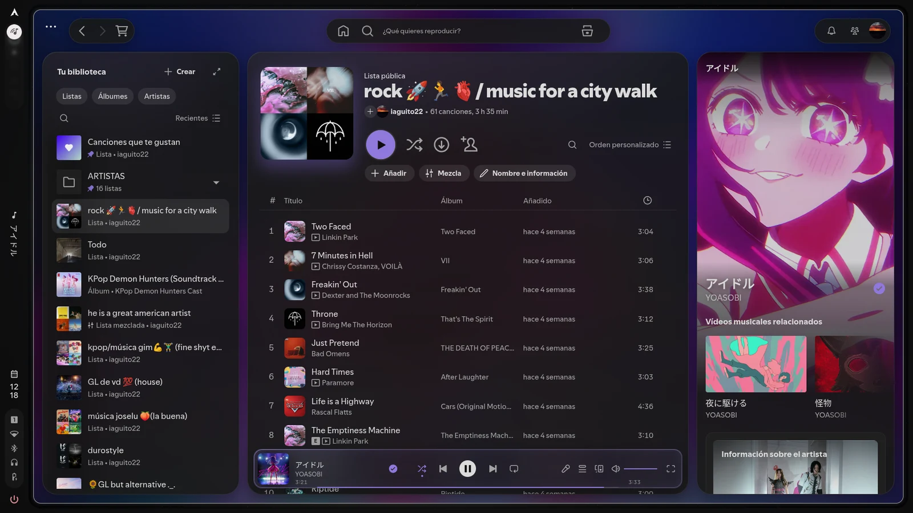
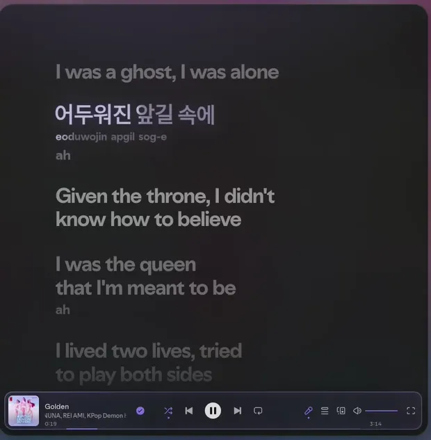
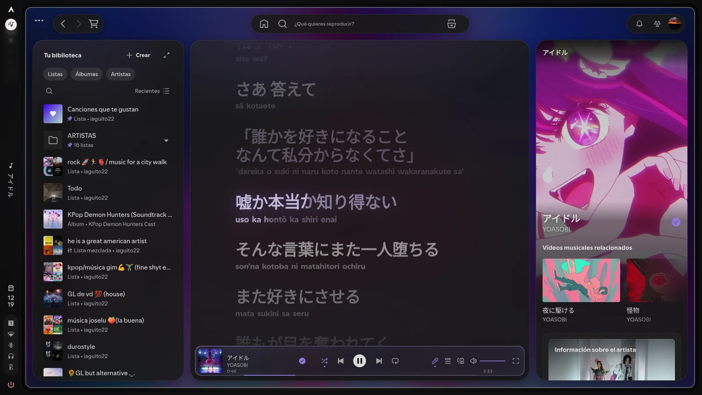
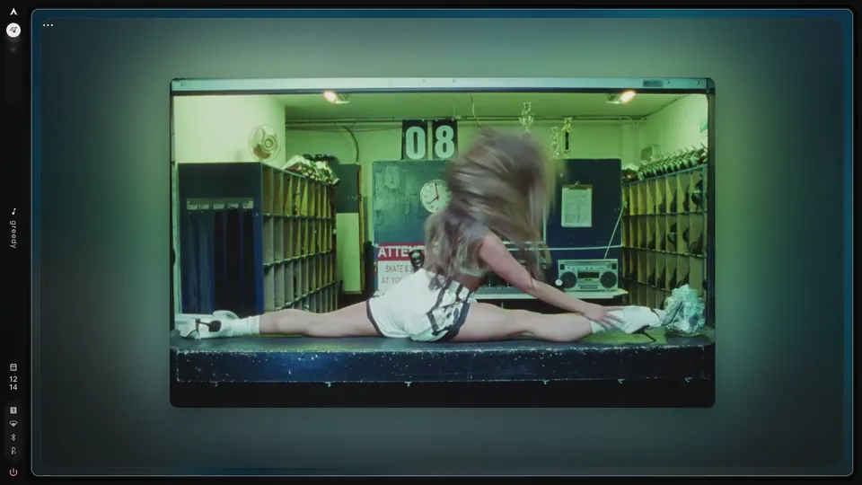

# Caelestia for Spicetify

A Spotify theme where the panels float as rounded islands and **the only color comes from the song that's playing**.

> [!IMPORTANT]
> This is a theme for **[Spicetify](https://spicetify.app)**, not a standalone app. Install Spicetify first and run `spicetify apply` once; then install the theme below.

*[Leer en español ↓](#-en-español)*



<p align="center"><a href="screenshots/demo.mp4">▶ Full demo (MP4, 31 s)</a></p>

## Design

- **Islands.** Library, main view and right panel float over the background with concentric corners (28 → 16 → 8 px). The top bar is three pills: navigation, search, profile. The player is a floating liquid glass dock.
- **The cover is the palette.** Everything else is neutral gray, so the album art sets the mood: it fills the background (blurred) and tints the accent.
- **Less chrome.** No scrollbars, no focus rings, no boxes around lists. Buttons that aren't needed all the time appear on hover.

<p align="center">
  
  
</p>

## How the dynamic accent works

When a song starts, the cover is drawn into a tiny 24×24 canvas. Each colored pixel votes for its hue, weighted by how saturated it is; grays, blacks and whites don't vote. The winning hue is clamped in saturation and lightness so it always reads against the background, and it fades in over ~1.4 s. Grayscale covers fall back to the scheme's own accent.

That color drives the play button, progress bar, active lyric, highlights and the tint of the liquid glass.



## How the lyrics work

- **On time.** Spotify highlights each line 0.1–0.9 s late. The theme ignores that and follows the song's clock, so each line lights up when it's sung.
- **Word by word.** Best timing source first:
  1. Real word timings (Apple Music, via the public lyricsplus API; Netease through Spicetify's CORS proxy as a fallback), lit letter by letter. *This sends the song title, artist, album and duration to those services.*
  2. Spotify's own syllable timings, when it provides them.
  3. Otherwise an estimate: words move at a singing pace and the last one is held until the next line, since singers usually stretch it.
- **Motion.** The word being sung lifts slightly; lines fade by distance, and the view scrolls smoothly to the current line.
- **Backing vocals.** Whatever is in parentheses goes on its own smaller, dimmer line under the main vocal, without the parentheses, and fills at the same time as the main line when both are sung together (with lyricsplus timings); a line that is all backing vocals is a smaller echo line.
- **Romanization.** Japanese, Chinese and Korean lyrics get a romanized line under each line that fills along with the singing (via Google Translate's public endpoint: the lyric lines are sent to Google); Cyrillic is transliterated locally.
- **Fullscreen.** With the lyrics open, the fullscreen button shows them across the whole screen over the blurred cover, with the artwork, title and artist on the left. The player and the cursor hide after 3 s without moving the mouse. A thin progress bar sits under the artist, the artwork pulses gently on the beat (Spotify's audio analysis) and tilts towards the mouse, and the player's fullscreen button shows an exit icon. Entering or leaving, the artwork flies between the player and its fullscreen spot over a blurred veil that hides the window re-layout.
- **Ambient mode.** In Spotify's fullscreen view, the background around the video (Canvas or music video) takes on its colours, blurred, like YouTube's ambient mode; the artwork there also tilts towards the mouse.

<p align="center">
  
  
</p>



> [!TIP]
> The theme already has its own synced, word-by-word lyrics. If you use a lyrics extension or custom app (like lyrics-plus or Beautiful Lyrics), you can remove it.

## Install

**Linux / macOS**
```bash
git clone https://github.com/iaguito22/spicetify-caelestia
cd spicetify-caelestia
./install.sh
```

**Windows** (PowerShell, no git needed)
```powershell
iwr -useb https://raw.githubusercontent.com/iaguito22/spicetify-caelestia/main/install.ps1 | iex
```
Or download the ZIP (Code → Download ZIP) and double-click `install.bat`.

It installs in dark mode. For light: `spicetify config color_scheme light`, then `spicetify apply`.

**White background, fixed green text or a moon button?** Another theme from Marketplace (e.g. *Default Dynamic*) is still installed and paints its own colors over these. The theme removes them, but uninstall it anyway: Marketplace → Installed → Remove.

**[Caelestia shell](https://github.com/caelestia-dots/shell) users:** set `color_scheme = caelestia`. The shell rewrites the colors on every scheme change and the theme follows, light/dark included.

## Status

| | |
|---|---|
| Linux, Spotify 1.2.96 | Built and tested here |
| Windows, Spotify 1.3.1 | Tested ([#3](https://github.com/iaguito22/spicetify-caelestia/issues/3)) |
| Windows, Spotify 1.3.3 | Supported, being tested ([#5](https://github.com/iaguito22/spicetify-caelestia/issues/5), [#6](https://github.com/iaguito22/spicetify-caelestia/issues/6)) |
| macOS | Untested |

Spotify renames its CSS classes between versions; lyrics and side panels break first. If something looks off, open an issue with a screenshot.

MIT license.

<br>

---
---

<br>

# 🇪🇸 En español

Un tema para Spotify con los paneles flotando como islas redondeadas, en el que **el único color lo pone la canción que está sonando**.


<p align="center"><a href="screenshots/demo.mp4">▶ Demo completa (MP4, 31 s)</a></p>

> [!IMPORTANT]
> Esto es un tema para **[Spicetify](https://spicetify.app)**, no una aplicación aparte. Primero instala Spicetify y ejecuta `spicetify apply` una vez; luego instala el tema siguiendo los pasos de abajo.

## Diseño

- **Islas.** La biblioteca, la vista principal y el panel derecho flotan sobre el fondo, con esquinas concéntricas (28 → 16 → 8 px). Arriba hay tres píldoras: navegación, búsqueda y perfil. El reproductor es un dock de liquid glass que flota sobre todo lo demás.
- **La portada manda.** El resto de la interfaz es gris neutro, así que es la portada la que pone el ambiente: ocupa el fondo, desenfocada, y de ella sale el color de acento.
- **Nada que sobre.** Sin barras de scroll, sin contornos de foco y sin recuadros alrededor de las listas. Los botones que no se usan todo el rato aparecen al pasar el ratón por encima.

<p align="center">
  
  
</p>

## Cómo se elige el color de acento

Al empezar cada canción, la portada se pinta en un lienzo diminuto de 24×24 píxeles. Cada píxel con color vota por su tono, y cuanto más saturado está, más pesa su voto; los grises, los negros y los blancos no cuentan. Al tono ganador se le ajustan la saturación y la luminosidad para que siempre se vea bien sobre el fondo, y entra con una transición de 1,4 s más o menos. Si la portada es en blanco y negro, se usa el acento del propio esquema de colores.

Ese color es el del botón de reproducir, la barra de progreso, la línea de la letra que se está cantando, los resaltados y el tinte del liquid glass.


## Cómo funciona la letra

- **Sincronizada de verdad.** Spotify marca cada línea con entre 0,1 y 0,9 s de retraso. El tema no le hace caso y se guía por el tiempo de la canción, así que cada línea se ilumina justo cuando se canta.
- **Palabra a palabra.** Usa la mejor fuente de tiempos que encuentre, por este orden:
  1. Los tiempos reales de cada palabra (de Apple Music, a través de la API pública de lyricsplus; de reserva, Netease por el proxy CORS de Spicetify), iluminados letra a letra. *Para eso se envían el título, el artista, el álbum y la duración de la canción a esos servicios.*
  2. Los tiempos por sílaba de Spotify, cuando los tiene.
  3. Si no hay ninguno, los calcula: las palabras avanzan al ritmo normal del canto y la última se alarga hasta la línea siguiente, porque es la que los cantantes suelen estirar.
- **Animación.** La palabra que se está cantando se eleva un poco, las líneas se van apagando cuanto más lejos están, y la vista se desplaza con suavidad hasta la línea actual.
- **Coros.** Lo que va entre paréntesis va en su propia fila, debajo de la voz, más pequeño y más tenue y sin los paréntesis; si suena a la vez que la voz, se rellenan a la vez (con los tiempos de lyricsplus). Una línea que es toda coro se ve como un eco más pequeño.
- **Romanización.** Las letras en japonés, chino y coreano llevan debajo de cada línea su romanización, que se rellena al cantarse (con el endpoint público de Google Translate: las líneas de la letra se envían a Google); el cirílico se translitera en local.
- **Pantalla completa.** Con la letra abierta, el botón de pantalla completa la muestra a toda pantalla sobre la portada difuminada, con la carátula, el título y el artista a la izquierda. El reproductor y el cursor se esconden a los 3 s sin mover el ratón. Bajo el artista hay una barra de progreso fina, la carátula late suave con los beats (análisis de audio de Spotify) y se inclina hacia el ratón, y el botón de pantalla completa del reproductor muestra el icono de salir. Al entrar y al salir, la carátula vuela entre el reproductor y su sitio en la pantalla completa sobre un velo difuminado que tapa la recolocación de la ventana.
- **Modo ambiente.** En la pantalla completa de Spotify, el fondo alrededor del vídeo (Canvas o videoclip) toma sus colores, difuminados, como el modo ambiente de YouTube; ahí la carátula también se inclina hacia el ratón.

<p align="center">
  
  
</p>


> [!TIP]
> El tema ya trae su propia letra sincronizada palabra a palabra. Si usas alguna extensión o app de letras (como lyrics-plus o Beautiful Lyrics), puedes quitarla.

## Instalación

**Linux / macOS**
```bash
git clone https://github.com/iaguito22/spicetify-caelestia
cd spicetify-caelestia
./install.sh
```

**Windows** (en PowerShell; no necesitas git)
```powershell
iwr -useb https://raw.githubusercontent.com/iaguito22/spicetify-caelestia/main/install.ps1 | iex
```
También puedes descargar el ZIP (Code → Download ZIP) y abrir `install.bat` con doble clic.

Se instala en modo oscuro. Si lo prefieres claro: `spicetify config color_scheme light` y luego `spicetify apply`.

**¿Fondo blanco, texto verde fijo o un botón de luna?** Sigue instalado otro tema de Marketplace (p. ej. *Default Dynamic*) que pinta sus colores encima. El tema los quita, pero desinstálalo igualmente: Marketplace → Instalados → Eliminar.

**Si usas [Caelestia shell](https://github.com/caelestia-dots/shell):** pon `color_scheme = caelestia`. El shell reescribe los colores cada vez que cambias de esquema y el tema se adapta solo, también al pasar de claro a oscuro.

## Estado

| | |
|---|---|
| Linux, Spotify 1.2.96 | Desarrollado y probado aquí |
| Windows, Spotify 1.3.1 | Probado ([#3](https://github.com/iaguito22/spicetify-caelestia/issues/3)) |
| Windows, Spotify 1.3.3 | Compatible, en pruebas ([#5](https://github.com/iaguito22/spicetify-caelestia/issues/5), [#6](https://github.com/iaguito22/spicetify-caelestia/issues/6)) |
| macOS | Sin probar |

Spotify cambia los nombres de sus clases CSS de una versión a otra, y lo primero que suele romperse es la letra y los paneles laterales. Si ves algo raro, abre un issue con una captura.

Licencia MIT.
